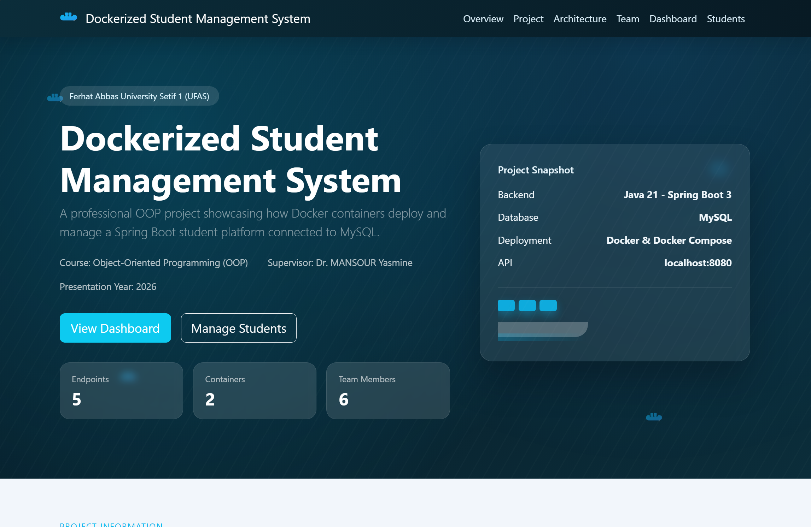
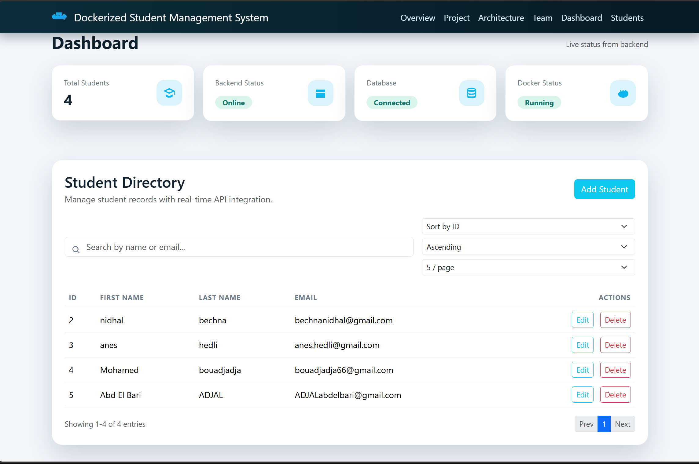
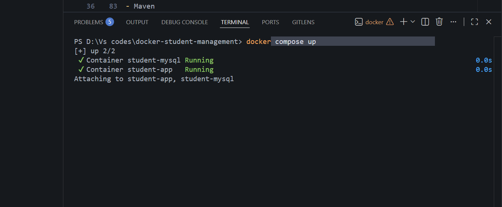

# Dockerized Student Management System

A professional OOP university project demonstrating Docker containerization of a Spring Boot 3 student management application. Built with Java 21, MySQL, Docker Compose, and a modern responsive frontend.

## 🎓 Project Information

**Course:** Object-Oriented Programming (OOP)  
**University:** Ferhat Abbas University Setif 1 (UFAS)  
**Supervisor:** Dr. MANSOUR Yasmine  
**Year:** 2026

**Team Members:**
- HEDLI Anes
- MAOUCHE Chakib
- BECHNA Nidhal
- ADJAL Abd El Bari
- BOUADJADJA Mohammed El Amine
- BOUROUINA Souhile

## 🚀 Project Objective

Demonstrate how Docker containers simplify deployment, scalability, and environment consistency for a Java Spring Boot application connected to MySQL. This project showcases:

- Docker containerization patterns
- Multi-container orchestration with Docker Compose
- Spring Boot microservices architecture
- RESTful API design
- Modern responsive frontend with Bootstrap 5
- Cross-origin resource sharing (CORS) configuration

## Project Achievements

- Developed Spring Boot REST API
- Implemented complete CRUD operations
- Integrated MySQL database
- Containerized application with Docker
- Orchestrated services using Docker Compose
- Implemented responsive frontend dashboard
- Configured CORS communication
- Added exception handling and validation
- Implemented persistent database storage

## System Architecture

```
Frontend (HTML/CSS/JS)
|
v
Spring Boot REST API
|
v
MySQL Database
|
v
Docker Containers
```

## Demonstration Scenario

- User opens dashboard
- User creates a student
- Frontend sends POST request
- Spring Boot processes request
- MySQL stores data
- Docker containers manage deployment
- Student appears in dashboard

## 📸 Screenshots








## 📋 Tech Stack

### Backend
- Java 21
- Spring Boot 3.3.x
- Maven
- Spring Data JPA
- Bean Validation
- Logging (SLF4J)

### Database
- MySQL 8.4

### Frontend
- HTML5
- CSS3 (with Glassmorphism effects)
- Vanilla JavaScript
- Bootstrap 5
- Fetch API for HTTP requests

### DevOps
- Docker
- Docker Compose
- Multi-stage Docker builds

## 📁 Project Structure

```
docker-student-management/
├── Dockerfile                          # Multi-stage Docker build
├── docker-compose.yml                  # Container orchestration
├── pom.xml                            # Maven dependencies
│
├── src/
│   └── main/
│       ├── java/com/example/studentmanagementsystem/
│       │   ├── StudentManagementSystemApplication.java
│       │   ├── config/
│       │   │   └── WebConfig.java                      # CORS configuration
│       │   ├── controller/
│       │   │   └── StudentController.java
│       │   ├── entity/
│       │   │   └── Student.java
│       │   ├── exception/
│       │   │   ├── ApiError.java
│       │   │   ├── ResourceNotFoundException.java
│       │   │   └── RestExceptionHandler.java
│       │   ├── repository/
│       │   │   └── StudentRepository.java
│       │   └── service/
│       │       ├── StudentService.java
│       │       └── impl/
│       │           └── StudentServiceImpl.java
│       └── resources/
│           └── application.properties
│
├── frontend/
│   ├── index.html                      # Main HTML with hero section
│   ├── css/
│   │   └── style.css                   # Modern Docker-inspired styling
│   ├── js/
│   │   └── app.js                      # Frontend CRUD operations
│   └── assets/
│       └── docker-mark.svg
│
├── README.md                           # This file
├── .gitignore                          # Git ignore rules
└── docker-compose.yml                  # Production setup
```

## ⚙️ Configuration

### Backend Configuration

`src/main/resources/application.properties`:
```properties
spring.application.name=student-management-system
spring.datasource.url=${SPRING_DATASOURCE_URL:jdbc:mysql://localhost:3306/student_management?useSSL=false&allowPublicKeyRetrieval=true&serverTimezone=UTC}
spring.datasource.username=${SPRING_DATASOURCE_USERNAME:root}
spring.datasource.password=${SPRING_DATASOURCE_PASSWORD:Mouhamed10082006}
spring.datasource.driver-class-name=com.mysql.cj.jdbc.Driver
spring.jpa.hibernate.ddl-auto=update
spring.jpa.show-sql=false
```

### Docker Environment Variables

**docker-compose.yml** sets these for containerized deployment:
```yaml
SPRING_DATASOURCE_URL: jdbc:mysql://mysql:3306/student_management?useSSL=false&allowPublicKeyRetrieval=true&serverTimezone=UTC
SPRING_DATASOURCE_USERNAME: root
SPRING_DATASOURCE_PASSWORD: Mouhamed10082006
```

### CORS Configuration

WebConfig.java enables cross-origin requests for frontend communication:
```java
registry.addMapping("/**")
    .allowedOriginPatterns("*")
    .allowedMethods("GET", "POST", "PUT", "DELETE", "OPTIONS")
    .allowedHeaders("*");
```

## 📊 Database Schema

**Student Table**
```sql
CREATE TABLE student (
    id BIGINT AUTO_INCREMENT PRIMARY KEY,
    first_name VARCHAR(100) NOT NULL,
    last_name VARCHAR(100) NOT NULL,
    email VARCHAR(255) NOT NULL UNIQUE
);
```

## 🌐 REST API Endpoints

Base URL: `http://localhost:8080`

| HTTP Method | Endpoint                    | Description              | Status Code |
|-------------|-----------------------------|--------------------------|-------------|
| GET         | `/students`                 | Retrieve all students    | 200 |
| GET         | `/students/{id}`            | Get student by ID        | 200 |
| POST        | `/students`                 | Create new student       | 201 |
| PUT         | `/students/{id}`            | Update student           | 200 |
| DELETE      | `/students/{id}`            | Delete student           | 204 |

### Example Requests

**Create Student:**
```bash
curl -X POST http://localhost:8080/students \
  -H "Content-Type: application/json" \
  -d '{
    "firstName": "Ahmed",
    "lastName": "Bouali",
    "email": "ahmed@example.com"
  }'
```

**Get All Students:**
```bash
curl http://localhost:8080/students
```

**Update Student:**
```bash
curl -X PUT http://localhost:8080/students/1 \
  -H "Content-Type: application/json" \
  -d '{
    "firstName": "Ahmed",
    "lastName": "Mohamed",
    "email": "ahmed.new@example.com"
  }'
```

**Delete Student:**
```bash
curl -X DELETE http://localhost:8080/students/1
```

## 🐳 Docker Setup

### Prerequisites
- Docker Desktop installed and running
- Docker Compose installed

### Building Locally

Build the JAR first:
```bash
mvnd clean package
```

Or with standard Maven:
```bash
mvn clean package
```

### Running with Docker Compose

**Start all services:**
```bash
docker-compose up --build
```

**In detached mode (background):**
```bash
docker-compose up --build -d
```

**Stop services:**
```bash
docker-compose down
```

**View logs:**
```bash
docker-compose logs -f app
docker-compose logs -f mysql
```

### Container Details

**Spring Boot Container**
- Image: Custom-built (see Dockerfile)
- Port: 8080
- Depends on: MySQL service

**MySQL Container**
- Image: mysql:8.4
- Port: 3306
- Database: student_management
- Root Password: Mouhamed10082006
- Data persists in named volume: `mysql_data`

## 🎨 Frontend Features

The modern dashboard includes:

- **Hero Section** with animated background
- **Project Information** displaying objective, technologies, and Docker strategy
- **Docker Visualization** showing container communication flow
- **Team Section** with all project contributors
- **Supervisor Section** with academic guidance information
- **Live Dashboard** with system status indicators
- **Student Directory** with:
  - Search by name or email
  - Sort by multiple fields
  - Pagination
  - Add/Edit/Delete modals
  - Success/error notifications
  - Loading animations
  - Empty state messages

### Frontend URLs

- **Development:** `http://localhost:8000` (if using local server)
- **Via Docker:** Serve `frontend/` folder via web server on port 80 or open `index.html` directly

## 🚀 Quick Start Guide

### Option 1: Docker Compose (Recommended)

```bash
# Clone and navigate to project
cd docker-student-management

# Build and start all services
docker-compose up --build -d

# Wait 10-15 seconds for MySQL to initialize
# Open frontend: Open frontend/index.html in browser
# API will be available at http://localhost:8080/students
```

### Option 2: Local Development

```bash
# Start MySQL locally
# Ensure database exists:
# mysql -u root -p
# CREATE DATABASE student_management;

# Build and run Spring Boot
mvnd clean package
mvnd spring-boot:run

# Serve frontend
# Use any HTTP server (Python, Node, VS Code Live Server)
python -m http.server 8000 --directory frontend

# Open http://localhost:8000 in browser
```

## 🔍 Health Checks

Docker Compose includes health checks:

```yaml
healthcheck:
  test: ["CMD", "mysqladmin", "ping", "-h", "localhost", "-pMouhamed10082006"]
  interval: 10s
  timeout: 5s
  retries: 5
```

The app container waits for MySQL to be healthy before starting.

## 📝 API Response Format

**Success Response:**
```json
[
  {
    "id": 1,
    "firstName": "Ahmed",
    "lastName": "Bouali",
    "email": "ahmed@example.com"
  }
]
```

**Error Response:**
```json
{
  "timestamp": "2026-06-01T10:30:00.000Z",
  "status": 404,
  "error": "Not Found",
  "message": "Student not found with id: 999",
  "path": "/students/999"
}
```

## 🔐 Security Considerations

- CORS enabled for localhost development
- Environment variables for sensitive data (passwords)
- Input validation via Bean Validation
- Error handling with proper HTTP status codes
- No SQL injection (using JPA parameterized queries)

## 📊 Logging

Backend logs are configured in Spring Boot:

- Log level: INFO
- Output: Console (Docker logs)
- Exception handling with proper log levels (WARN, ERROR)

View logs:
```bash
docker-compose logs -f app
```

## 🧪 Testing

Run tests:
```bash
mvnd test
# or
mvn test
```

## 🐛 Troubleshooting

### MySQL connection timeout
```bash
# Wait for MySQL to fully start
docker-compose logs mysql

# Restart only MySQL
docker-compose restart mysql
```

### Port already in use
```bash
# Change ports in docker-compose.yml
# MySQL: "3307:3306" (local:container)
# App: "8081:8080"
```

### Frontend fetch errors
- Ensure backend is running: `curl http://localhost:8080/students`
- Check CORS configuration in WebConfig.java
- Open browser DevTools → Network tab for request details

### Clean rebuild
```bash
# Remove all containers and volumes
docker-compose down -v

# Rebuild everything
docker-compose up --build -d
```

## Learning Outcomes

The team strengthened practical skills in:

- Object-Oriented Programming
- Spring Boot
- REST APIs
- MySQL integration
- Docker containerization
- Docker Compose orchestration
- Frontend/backend communication
- Software deployment concepts

## Conclusion

This project demonstrates how Docker streamlines deployment and ensures consistent environments for Java Spring Boot applications by encapsulating the API and database into reproducible containers.

## 📚 Resources

- [Spring Boot Documentation](https://spring.io/projects/spring-boot)
- [Docker Documentation](https://docs.docker.com)
- [Bootstrap 5 Documentation](https://getbootstrap.com/docs/5.0)
- [MySQL Documentation](https://dev.mysql.com/doc)

## 📄 License

University Project - UFAS 2026

## 👥 Contact

For questions about this project, contact the development team or Dr. MANSOUR Yasmine.
